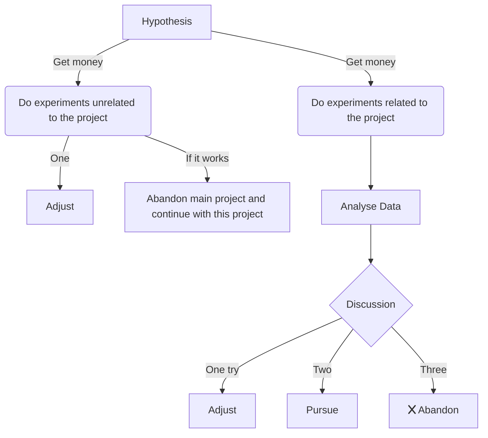

# SciVis_Mermaid
KI SciVis Course_Mermaid Exercise

```mermaid
 flowchart TD
    A[Hypothesis] -->|Get money| B(Do experiments related to the project) 
    A --> |Get money| H(Do experiments unrelated to the project) 
    H --> |One| K[Adjust]
    H --> |If it works| L[Abandon main project and continue with this project]
    B --> C[Analyse Data]
    C --> D{Discussion}
    D -->|One try| E[Adjust]
    D -->|Two| F[Pursue]
    D -->|Three| G[fa:fa-x Abandon]
```
